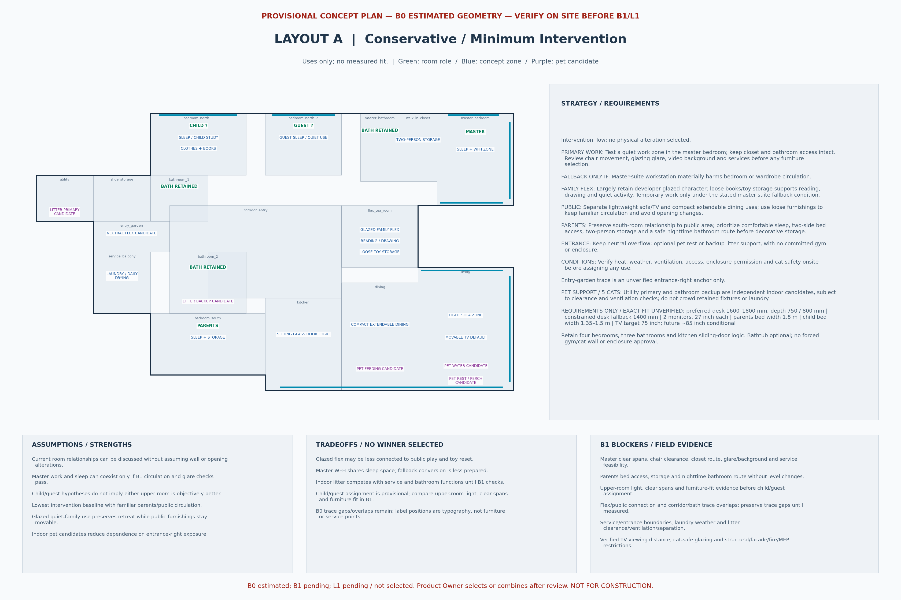
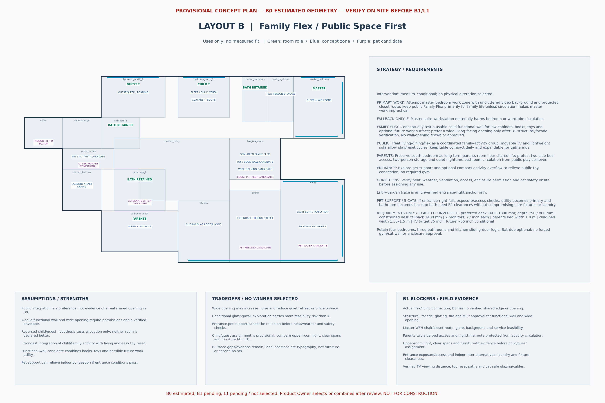
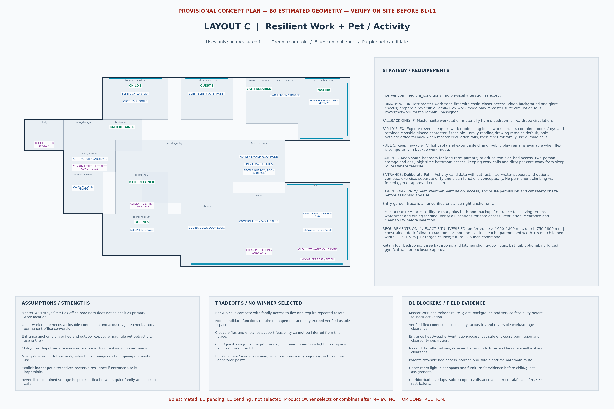

# Layout A / B / C v0.1 — provisional comparison

**PROVISIONAL CONCEPT PLAN — B0 ESTIMATED GEOMETRY — VERIFY ON SITE BEFORE B1/L1**

[Issue #9](https://github.com/yanxinnnnnn/lingnanxu-803-renovation/issues/9) is the implementation specification.
These concepts bind [Space Program v0.1](SPACE_PROGRAM_v0.1.md) to
[B0.3 semantic zones](B0.3_LAYOUT_INPUT.md), using the original B0 trace unchanged.
They compare room uses and strategies; no furniture fit, wall/opening alteration,
cabinetry, enclosure or MEP location is established. The project remains **B0**,
**construction_ready: false**, **B1 pending**, **L1 pending / not selected**.
Product Owner selects or combines after review; no winner is selected here.

## Compare the concepts

The WFH and comfort descriptions below are intentions and risks, not measured quality scores.

| Comparison | A — Conservative / Minimum Intervention | B — Family Flex / Public Space First | C — Resilient Work + Pet / Activity |
| --- | --- | --- | --- |
| Intervention level | Lowest; preserve room relationships and largely retain glazed flex; no wall/opening changes assumed | Medium, conditional; test one solid functional wall and wide living-facing opening | Medium, conditional; reversible work/storage modes and deliberate entrance pet/activity zoning; no permanent office conversion |
| Master WFH quality | Quiet work zone inside master; least preparation for fallback | Master work first so public flex remains available for family activity | Master work first, with a more prepared reversible backup work mode |
| Parents' comfort | South bedroom remains long-term parents room near public life; prioritize two-side bed access, storage and night route | Same room and priorities; protect sleep/night route from increased activity spillover | Same room and priorities; keep calls and dirty pet care away from sleep routes where feasible |
| Child / guest hypothesis | `bedroom_north_1 → child`, `bedroom_north_2 → guest` with quiet second use | Reverse: `bedroom_north_1 → guest` with reading, `bedroom_north_2 → child` | Same assignment as A; guest sleep plus quiet hobby |
| Public-space flexibility | Familiar separate sofa/media and compact dining uses; loose furnishings | Strongest family/public integration; play/reset cycles coordinate living, dining and flex | Public play, light sofa, movable TV and extendable dining remain available during backup calls |
| Family Flex utility | Glazed reading/drawing/toys/quiet activity; temporary work only if master fails | Semi-open family extension; books/toys/low-cabinet wall candidate, optional future work surface | Default quiet family use; reversible contained storage/work surface, closable connection candidate for backup calls |
| Entrance-right use | Neutral flex; optional pet support, no committed gym | Pet-support / compact activity overflow candidate | Deliberate Pet + Activity candidate: rest, litter/water support, optional compact exercise if conditions permit |
| Five-cat infrastructure | Utility primary litter and bathroom backup candidates; indoor living water/rest and dining feeding | Entrance litter candidate, utility indoor backup/primary alternative and bathroom alternate; living water, dining feeding, loose flex rest | Dirty entrance support candidate with utility/bath alternatives; indoor water, feeding and rest remain available regardless of entrance feasibility |
| Storage / toy handling | Loose flex toy/books storage; moderate bedroom storage | Functional-wall candidate prioritizes accessible public toy reset over display | Contained reversible toy/book storage; reset flex after calls to restore family utility |
| Future adaptability | Few assumptions, easy loose-furniture changes; backup office needs more preparation | Strong public utility; wide opening could reduce acoustic privacy | Most prepared for future WFH/pet/activity changes; competing uses require repeated resets |
| Major risks / B1 blockers | Master work/sleep fit; parents bed/route; indoor litter vs service/bath clearance; glazed flex connection | Actual flex/living connection, solid-wall and wide-opening permissions; noise; entrance exposure and indoor pet alternatives | Master fallback trigger, closable flex/acoustics/glare, work/storage clearances; entrance exposure/enclosure/cat safety; indoor pet alternatives |

## Shared requirements and evidence boundaries

All concepts preserve four bedrooms: homeowner + spouse master suite, long-term
parents in `bedroom_south`, and two upper rooms provisionally assigned to child/guest.
The child room is growth-oriented, with sleep, proper study, clothing and books;
public play supplements it. Every guest hypothesis preserves true overnight sleeping
and a useful second function. Furniture mechanisms remain unselected.

**Neither upper room is declared objectively better.** Final child/guest allocation
waits for **B1 light, clear-span and furniture-fit evidence**. The reversal in B tests
allocation rather than asserting a room-quality ranking.

Three bathrooms remain: `bathroom_1`, `bathroom_2`, `master_bathroom`.
Master bathtub is optional only if verified circulation permits it without compromising
core functions. Retain kitchen sliding-glass-door logic, dining-area dishwasher
relationship, compact everyday extendable dining and the movable-TV strategy.
TV anti-tip measures, lockable wheels and safe console/power/network cables matter.
Service-balcony laundry/daily hanging remains a candidate pending weather,
drainage and enclosure checks. No forced bathtub, gym or permanent cat wall.

Primary WFH is attempted **inside the master suite first in every concept**.
Family Flex becomes WFH fallback **only if the master-suite workstation materially
harms bedroom or wardrobe circulation**. C prepares a reversible fallback mode;
it does not activate that mode or designate flex as primary office. B's future work
surface is also conditional. Chair clearance, closet/bath access, glazing glare,
video-call background, power/network and cable management need verified evidence.

Numeric targets appear only as **Space Program requirement labels**, never scaled
furniture rectangles or fit claims: preferred desk 1600–1800 mm, depth 750/800 mm;
constrained desk fallback 1400 mm; two 27-inch monitors; parents bed width 1.8 m;
child bed width 1.35–1.5 m; TV planning target 75 inches, approximately 85-inch
future compatibility only if viewing distance supports it. No new linear dimensions,
missing lengths, walls or rescaling are introduced.

Each pet strategy covers litter primary and backup/expansion candidates, fountain
water with safe power, feeding, scratch/rest/perch and cleaning/hair management.
Litter is separated from food/water as a conceptual requirement, not a validated
distance. A distributes support indoors. B/C test entrance support but retain
independent indoor utility and bathroom candidates: if the entrance fails, utility
can become primary with bathroom backup. These candidates still require dry
clearance, ventilation and access checks; neither fixtures nor laundry are displaced
by a fit assumption. Current two open non-automatic boxes are a household baseline,
not a limit on future locations. Ordinary doors provide temporary access control;
window/balcony escape and fall protection and cable safety remain required.

The `entry_garden` polygon is only an **unverified review anchor** for entrance-right
discussion. B0.3 leaves service/entry correspondence unresolved. No concept verifies
its boundary or approves an enclosure. Heat, weather, ventilation, access, enclosure
permission and cat safety must pass onsite checks before pet/activity use. If unsuitable,
keep it neutral and distribute functions indoors. Do not concentrate all pet support there.

B0.3's high semantic mappings for parents/flex/kitchen/dining/living support use
discussion only. The third-party reference is not unit 803. Suite area remains a
candidate for bedroom + closet + bath, never a master-bedroom fit budget; corridor
scope is also unresolved. Unassigned reference areas stay unassigned. The B0 trace
has no verified flex/public shared opening and retains corridor/bath overlaps. New
labels do not bridge, repair or reinterpret those boundaries.

## Review artifacts and assumptions

The source of concept intent is [structured concept data](../data/layout_concepts_v0.1.yaml).
Each DXF retains every original B0 modelspace entity, adds only TEXT on
`A-CONCEPT-ROLE`, `A-CONCEPT-ZONE`, `A-CONCEPT-PET`, `A-CONCEPT-NOTE`, and
includes assumptions, strengths, tradeoffs and B1 blockers. Label positions and
text sizes serve typography only. PNGs render those conceptual uses on the same trace;
reading the strategy panels is essential because apparent label placement is not fit.

| Concept | DXF | Review preview |
| --- | --- | --- |
| A | [Layout A](../cad/LN803_LAYOUT_A_B0_v0.1_20261008.dxf) | [A preview](../artifacts/LN803_LAYOUT_A_B0_v0.1_20261008_preview.png) |
| B | [Layout B](../cad/LN803_LAYOUT_B_B0_v0.1_20261008.dxf) | [B preview](../artifacts/LN803_LAYOUT_B_B0_v0.1_20261008_preview.png) |
| C | [Layout C](../cad/LN803_LAYOUT_C_B0_v0.1_20261008.dxf) | [C preview](../artifacts/LN803_LAYOUT_C_B0_v0.1_20261008_preview.png) |





A assumes current relationships remain useful without opening changes; its strength
is low intervention and indoor pet distribution, with less integrated play and a less
prepared work fallback. B assumes a functional wall/wide opening can be explored;
its strength is public activity/toy reset, with greater permissions and noise risk.
C assumes a reversible closable quiet-work mode is worth testing; its strength is
adaptability and indoor alternatives, with greater competition and reset effort.
All three assume B1 may invalidate fit or entrance use, and keep those decisions open.

## Reproduce and validate

From a clean checkout with Python 3.12 and locked dependencies:

```bash
uv sync
uv run python scripts/validate_layout_concepts.py
uv run python scripts/generate_layout_concepts.py
uv run python scripts/validate_layout_concepts.py --artifacts
uv run pytest
git diff --check
git status --short
```

Generation uses a fixed date, DXF metadata and PNG metadata, independent of wall
clock time and Python hash seed. `--output-dir` selects an isolated root containing
`cad/` and `artifacts/`; `--concept A` selects one variant. Existing unrelated files
and prior inputs/baselines cannot be overwritten. Regeneration of the canonical
concept paths is allowed. Tests compare independent process outputs with the committed
DXF/PNG bytes, pin previous baseline hashes, reject unauthorized geometry/precision
upgrades and retain the existing B0 checks. The prior readiness assertion advances
to `concept_variants_ready`; its B0 preservation checks remain.

Validation on 2026-10-08: **265 tests passed**, all concept DXF/PNG outputs and
the saved B0.1/B0.2/B0.3 DXFs validated, `git diff --check` passed, and no prior
baseline/input changes appeared against merged `main`. All three PNGs were visually
reviewed, including the small flex/entrance labels. In this Windows sandbox the test
run used `.venv/Scripts/python.exe` with pytest's base temp and subprocess `TMP`/`TEMP`
inside ignored `.pytest_cache/` to avoid restricted system-temp writes; locked
dependencies and the earlier generator code were unchanged.

Next review should record PO preferences or combinations, then collect evidence in
[the 803 onsite worksheet](../measurements/onsite-survey-803.md). Structural, facade,
glazing, fire and MEP feasibility requires verified documentation/professional checks.
No B1 or L1 completion is claimed by this sprint; the PR remains unmerged pending acceptance.
